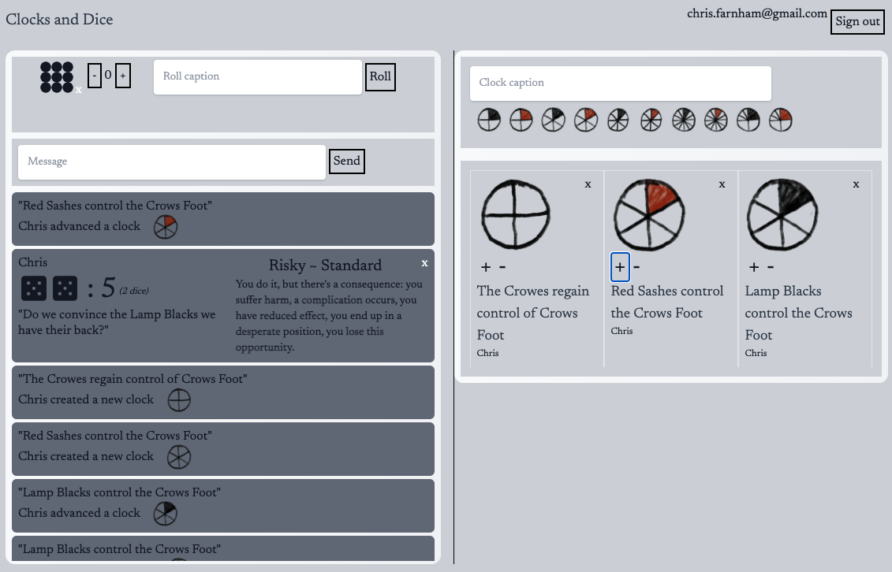

# Clocks and Dice

Source code for [Clocks and Dice](https://clocksanddice.seefar.dev), an assistant 
(dice roller, chat, and clock tracker) for 
[Evil Hat Productions'](https://www.evilhat.com/home/) [Blades in the Dark](https://bladesinthedark.com/).

This repository and the Clocks and Dice website have no ownership or affiliation with Evil Hat Productions
and Blades in the Dark.

This is built with [re-frame](https://github.com/day8/re-frame) and Google's Firebase. Details on the
[re-frame template and this project](docs/REFRAME.md).

Clocks and Dice is a casual hobby tool for playing over voice/video chat with friends, not a
place to share sensitive information. A channel name is only a convenience so your group can find
its own session instead of a stranger's — pick something specific enough that no one stumbles
onto it by guessing, and share it just with the people in your game. It is not a security boundary
or an authentication credential: Firebase's access rules allow any signed-in (including
anonymous) user to read and write any channel, so channel names should not be treated as secrets.

## Acknowledgements

Clocks and Dice is a personal project that is built upon other's work

### AshtonHand Clocks

Clock images were built using [AshtonHand Clocks](https://acegiak.itch.io/ashtonhand-clocks) Note that 
this github repo does not include these clock images. You will have to download them from itch.io 
and add them to the `resources/public/images/` directory for the Clocks and Dice site to render properly.

### Skyjedi's SWRPG dice roller

Skyjedi's [SWRPG dice roller](https://dice.skyjedi.com/), which my regular roleplaying group 
has used for almost a year during covid, was a direct inspiration for this app. My main motivation
was that wanting a shared virtual dice roller like this one but for Blades in the Dark.

### Henry Widd

This work and the Clocks and Dice site are a pet project started because I wanted to learn how
to build sites with Firebase, re-Frame and Clojurescript. There are lots of resources for these
technologies online but the one that was most helpful was Henry Widd's blog post 
[Wrapper-free Firebase with Clojurescript's Re-Frame](https://widdindustries.com/clojurescript-firebase-simple/)
and [source code](https://github.com/henryw374/firebase-clojurescript-todo-list).

Henry's code best matched my own style of coding (simple, clear calls to libraries). After reading his blog
post and playing with his example code, I formed a clear idea of how to build Clocks and Dice. The initial firebase
binding code was taken directly from him.

[Donate](https://www.paypal.com/paypalme/chrisfarnham)

